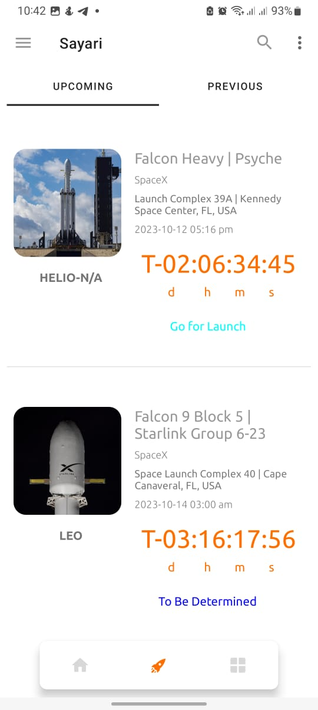

# Sayari Mobile Application :hammer:

## Project Summary: 
The Sayari mobile app is designed to provide up-to-the-minute news from top space companies, including launch updates and news. Stay informed with the latest developments in spaceflight through this convenient and easy-to-use app.

### Api Used: 
- The Launch schedule/calendar is provided by The LL2 Library: [LL2 Docs](https://thespacedevs.com/llapi)
- Spaceflight news is provided by Spaceflight News API: [Spaceflight News API docs](https://api.spaceflightnewsapi.net/v4/docs/)

### Reasons for using the APIs
- Both APIs have a free plan. The Spaceflight news API is free and calls are unlimited. For the LL2 Apis, the free plan is limited to 15 requests per hour.
- Multiple ways to query and filter Launch and Spaceflight news data
- They have a significantly large user base and can handle millions of requests. If the app were ever to scale, there is confidence in the API to provide high availability
- The APIs come with really high-quality images of spacecraft, in-flight, ISS, and planetary bodies that will highly complement the application.

## How to Access the App
The app is readily available in Play Store. Click the download here link below to download and use. The app is compatible with devices from min SDK 21 all the way to SDK 33 but currently has no support for foldable, tablets, or TVs. Support for these will be added in the next update patch. 

## [Download Here](https://play.google.com/store/apps/details?id=com.dev.james.sayariproject)

# Design/Architecture used :triangular_ruler:

You can find the project Figma design files [here](https://www.figma.com/file/nPi8e77EuckWb6hO5kMsFB/Sayari-v2-design?type=design&node-id=0%3A1&mode=design&t=MZcWtP9rzsSIplIq-1) 

The application uses the MVVM architecture. MVVM basically stands for Model View View Model. It is the recommended design pattern
by the Android developers community for building well-structured apps as part of the modern Android development guide.[Read more here.](https://www.geeksforgeeks.org/mvvm-model-view-viewmodel-architecture-pattern-in-android/) 

### Model 
This layer is responsible for the abstraction of the data sources. Model and ViewModel work together to get and save the data.
### View 
The purpose of this layer is to inform the ViewModel about the user’s action. This layer observes the ViewModel and does not contain any kind of application logic.
### View Model 
It exposes those data streams which are relevant to the View. Moreover, it serves as a link between the Model and the View. The project uses

## Dependencies/Libraries used in the project
1. Kotlin coroutines - for concurrency and asynchronous tasks [ read more here :point_right:](https://developer.android.com/kotlin/coroutines?gclid=CjwKCAiAheacBhB8EiwAItVO20G0FiS_NrE86uFAyMj0jzN1IVsBxeyOBwW__JKCrtGCpTFpAQEHkRoCPXQQAvD_BwE&gclsrc=aw.ds)
2. Dagger Hilt - for dependency injection [ read more here :point_right:](https://developer.android.com/training/dependency-injection/hilt-android)
3. XML - for building UI components , defining strings ,colors and shapes.
4. Retrofit and Okhttp - for making network calls to the backend and also logging of responses. [ read more here :point_right:](https://square.github.io/retrofit/)
5. Jetpack Room - used for caching complex datasets locally [read more here :point_right:](https://developer.android.com/training/data-storage/room)
6. Jetpack datastore -  a data storage solution that allows you to store key-value pairs or typed objects with protocol buffers. [read more here :point_right:](https://developer.android.com/topic/libraries/architecture/datastore)
7. Jetpack Navigation Component - for traversing between different fragment screens. [read more here :point_right:](https://developer.android.com/guide/navigation/navigation-getting-started)
8. Lottie animations - for cool looking animations. [read more here :point_right:](https://lottiefiles.com/)
9. Timber - for log statements.
10. Firebase Cloud Messaging Services - for sending push notifications to devices. [read more here :point_right:](https://firebase.google.com/docs/cloud-messaging)
11. Firebase Crashlytics - for detailed in app crash reporting. [read more here :point_right:](https://firebase.google.com/docs/crashlytics)
12. Mockito - for implementing mocks during testing.[read more here :point_right:](https://site.mockito.org/)
13. Mock Web Server - for simulating network calls and responses during unit tests.[read more here :point_right:](https://github.com/square/okhttp/tree/master/mockwebserver)
14. Google truth library - for making assertions during unit and instrumented tests.[read more here :point_right:](https://truth.dev/)

## App screenshots:

  
&nbsp; &nbsp; &nbsp; &nbsp;
  
&nbsp; &nbsp; &nbsp; &nbsp;
    
&nbsp; &nbsp; &nbsp; &nbsp;

&nbsp; &nbsp; &nbsp; &nbsp;

&nbsp; &nbsp; &nbsp; &nbsp;

&nbsp; &nbsp; &nbsp; &nbsp;

